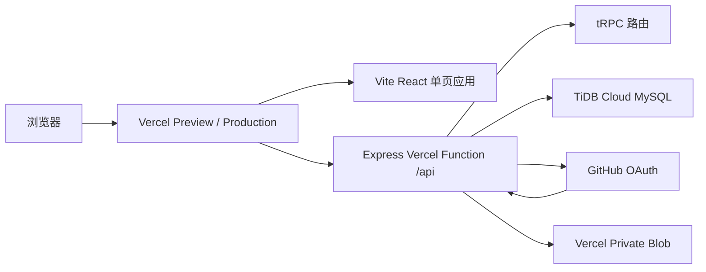

# 本草经方 · Vercel 完整部署手册

> **适用仓库**：`sincalaway/tcm`  
> **当前全栈预览分支**：`feat/vercel-fullstack-runtime`  
> **当前 Vercel 项目**：`away6/tcm`  
> **维护原则**：先在 Preview 验证，再经明确批准合并 `main` 发布 Production。

本文档说明如何部署、维护与排查“本草经方”中医学习网站。当前实现采用 React/Vite 前端、单一 Express Vercel Function、tRPC API、TiDB Cloud MySQL、GitHub OAuth，以及 Vercel Private Blob 知识库文件存储。

## 1. 部署目标与边界

本项目将公共学习资料与登录后的私人资料严格分开。未登录用户可检索本草、经方和古籍公开目录；登录用户才可访问笔记、收藏、学习进度与个人知识库。**生产环境不得复用 Preview 的 OAuth App、私有 Blob Store 或敏感环境变量。**

| 环境 | Git 分支 | Vercel 用途 | 是否允许真实个人资料 | 当前状态 |
|---|---|---|---|---|
| Preview | `feat/vercel-fullstack-runtime` | 功能开发、数据库与登录链路验收 | 可由用户自行进行受控验收 | 已启用 |
| Production | `main` | 面向正式访问者的稳定站点 | 仅在独立生产配置完成后启用 | 本轮未改动 |

当前稳定 Preview 地址如下：

```text
https://tcm-git-feat-vercel-fullstack-runtime-away6.vercel.app
```

当前生产地址如下，仅用于查看已有生产站点：

```text
https://tcm-away6.vercel.app
```

## 2. 当前架构



运行时路由由根目录 `vercel.json` 管理。构建命令为 `pnpm vercel:build`；所有 `/api/*` 请求先重写到单一 Express Function，而非 API 前端路径才回退至 Vite 的 `index.html`。这一顺序避免 SPA 深链接与 tRPC API 互相拦截。

```json
{
  "buildCommand": "pnpm vercel:build",
  "installCommand": "corepack enable && pnpm install --frozen-lockfile",
  "outputDirectory": "dist/public",
  "rewrites": [
    { "source": "/api/(.*)", "destination": "/api" },
    { "source": "/:path((?!api/).*)", "destination": "/index.html" }
  ]
}
```

> 不要把 `drizzle-kit migrate` 放入 Vercel Build Command。历史上构建期数据库迁移可能因超时留下部分 DDL；本项目改用经过审查的、幂等的应用运行时 schema 恢复逻辑。

## 3. 首次导入 Vercel 项目

在 Vercel 使用拥有 `sincalaway/tcm` 访问权限的 GitHub 账号登录，然后执行以下操作。

| 步骤 | Vercel 操作 | 应达到的结果 |
|---|---|---|
| 1 | 进入 [Vercel Dashboard](https://vercel.com/new)，点击 **Add New → Project**。 | 出现 Git 仓库导入列表。 |
| 2 | 选择 `sincalaway/tcm`。若未出现，先在 GitHub Integration 中授权仓库访问。 | 项目导入页显示仓库名称。 |
| 3 | Framework Preset 选择或保留 **Other**；不要改写仓库中的 `vercel.json`。 | 使用仓库内构建与路由定义。 |
| 4 | 将 **Production Branch** 固定为 `main`。 | 只有 `main` 的提交会进入 Production。 |
| 5 | 点击 Deploy。 | Vercel 创建初始部署。 |

在实际维护中，不应直接向 `main` 推送未验证代码。应先从 `feat/vercel-fullstack-runtime` 或新的功能分支生成 Preview，验证后再通过 Pull Request 合并。

## 4. Preview 环境变量配置

进入 Vercel 项目：**Settings → Environment Variables**。每次新增或更新变量后，都要重新部署对应环境，变量才会进入新的运行时实例。

### 4.1 Preview 必需变量

下表仅列出变量名、用途和环境范围。**不得在聊天、Git 提交、截图或 Markdown 文档中粘贴变量值。**

| 变量名 | 用途 | Preview | Production | 填写来源 |
|---|---|---:|---:|---|
| `DATABASE_URL` | TiDB Cloud MySQL 连接串 | 是 | 另行配置 | TiDB Connect 页面生成的 Node.js/General 连接串 |
| `JWT_SECRET` | GitHub 登录后的会话签名密钥 | 是 | 独立值 | 随机高熵字符串，建议至少 32 字符 |
| `GITHUB_CLIENT_ID` | Preview GitHub OAuth App 标识 | 是 | 否 | Preview 专用 OAuth App |
| `GITHUB_CLIENT_SECRET` | Preview GitHub OAuth App 密钥 | 是 | 否 | 与上述 Client ID 同一个 App 新生成的 Secret |
| `BLOB_STORE_ID` | Private Blob Store 标识 | 自动注入 | 否 | Vercel Blob 项目连接自动创建 |
| `BLOB_WEBHOOK_PUBLIC_KEY` | Blob 客户端直传回调验证公钥 | 自动注入 | 否 | Vercel Blob 项目连接自动创建 |

以下原则必须遵守：

1. `DATABASE_URL`、`JWT_SECRET`、`GITHUB_CLIENT_SECRET` 只能以 Vercel Secret 方式保存，不能写入 `.env`、源代码、文档或 GitHub Issues。
2. Preview 与 Production 的 `JWT_SECRET` 必须不同；不应把 Preview Cookie 扩展到生产域名。
3. 本项目的 Private Blob 连接使用 Vercel OIDC，不应手动添加长期 `BLOB_READ_WRITE_TOKEN`。如果界面提供 “Add a read-write token env var”，保持未选中即可。[1]
4. 若 Vercel 提示同名变量存在，优先 **Edit** 原变量，而不是创建同名重复项。

### 4.2 验证变量注入

以登录后的 Vercel 控制台访问 Preview 健康检查：

```text
https://tcm-git-feat-vercel-fullstack-runtime-away6.vercel.app/api/health
```

健康检查只返回布尔诊断，不应返回任何密钥值。重点确认如下字段：

| 字段 | 期望值 | 含义 |
|---|---|---|
| `databaseConfigured` | `true` | `DATABASE_URL` 已注入。 |
| `databaseReachable` | `true` | TiDB TLS 连接与只读检查成功。 |
| `schemaInitialized` | `true` | 核心 schema 已齐备。 |
| `oauthConfigured` | `true` | GitHub Client ID 与 Secret 均存在。 |
| `sessionConfigured` | `true` | `JWT_SECRET` 已配置且长度合格。 |
| `storageConfigured` | 在 Vercel Function 请求中为 `true` | Blob Store ID 与运行时 OIDC 令牌可用。 |

若 Preview 开启 Deployment Protection，直接在未登录浏览器访问可能跳转到 Vercel 登录页。这是部署保护行为，不等同于应用 API 错误。

## 5. TiDB Cloud MySQL 配置

### 5.1 创建与连接

在 TiDB Cloud 中创建或选择 Serverless Cluster，并创建目标数据库，例如 `tcm`。在 **Connect** 页面选择 Node.js/General 连接串，将其作为 `DATABASE_URL` 的 Preview 值粘贴到 Vercel。

| 检查项 | 正确做法 |
|---|---|
| TLS | TiDB Cloud 必须使用 TLS。应用已对 `*.tidbcloud.com` 显式启用证书校验。 |
| 密码 | 如果连接串显示 `<PASSWORD>`，这是占位符；应从 TiDB 页面复制完整可用连接串并在 Vercel 内保存。 |
| 数据范围 | Preview 的公开目录可运行幂等种子；不要为了测试创建虚构用户笔记、收藏或进度。 |
| DDL | 不要在 Vercel Build 阶段自动运行 Drizzle 迁移。 |

### 5.2 常见 TiDB 故障

| 现象 | 常见原因 | 处理方法 |
|---|---|---|
| `databaseReachable: false` | 未启用 TLS、凭据不匹配、连接串格式错误 | 从 TiDB Connect 页面重新复制连接串；不要手工暴露密码。 |
| 表不完整 | 历史构建期迁移部分完成 | 由应用启动时的非破坏性 schema 恢复语句补齐；不要重复执行未知迁移。 |
| 目录为空 | API rewrite 被 SPA 回退拦截或种子未成功 | 先检查 `/api/trpc/*` 是否仍由 Express 单入口处理，再检查 schema 与公开种子。 |

## 6. GitHub OAuth 配置

### 6.1 Preview OAuth App

在 GitHub：**头像 → Settings → Developer settings → OAuth Apps → New OAuth App**，创建专供 Preview 的 OAuth App。

| 字段 | Preview 推荐值 |
|---|---|
| Application name | `TCM Classics Preview` |
| Homepage URL | `https://tcm-git-feat-vercel-fullstack-runtime-away6.vercel.app` |
| Authorization callback URL | `https://tcm-git-feat-vercel-fullstack-runtime-away6.vercel.app/api/oauth/callback` |

创建后，在同一个 OAuth App 页面获取 Client ID，并点击 **Generate a new client secret** 生成 Secret。将二者分别写入 Vercel Preview 环境变量 `GITHUB_CLIENT_ID` 与 `GITHUB_CLIENT_SECRET`。GitHub OAuth App 的 Client ID 与 Client Secret 必须来自**同一个 App**。[2]

### 6.2 登录验收

在 Preview 点击“登录以记笔记”，完成 GitHub 授权。成功标准为：

1. 授权后浏览器回到 Preview 站点，而不是显示 JSON 错误。
2. Vercel Logs 中 `/api/oauth/callback` 返回 `302`。
3. 登录后可看到个人入口，但未登录状态不显示私人笔记、收藏、进度或知识库。

| 错误代码或现象 | 原因 | 修复 |
|---|---|---|
| `incorrect_client_credentials` | Client ID/Secret 不配对或 Secret 已失效 | 在同一 Preview OAuth App 生成新的 Secret，替换 Preview `GITHUB_CLIENT_SECRET` 并 redeploy。 |
| `bad_verification_code` | 授权码过期、重复使用或 App 配对错误 | 从站点重新发起一次完整登录，不要刷新旧 callback URL。 |
| `redirect_uri_mismatch` | GitHub 回调地址与应用实际地址不完全一致 | 逐字符核对 GitHub OAuth App 回调地址。 |
| `GitHub OAuth callback failed` | 需结合 Vercel Logs 判断阶段 | 只查看 HTTP 状态与 OAuth 错误码；不得记录 code、token 或 Secret。 |

## 7. Vercel Private Blob 配置

知识库可能包含用户个人 PDF、TXT 和 Markdown，因此必须使用 **Private Blob**，不能使用 Public Blob。Private Blob 的读取应始终先经过应用自己的认证与所有权检查。[1]

### 7.1 创建 Preview Blob Store

在 Vercel 项目中依次打开：**Storage → Create Database → Blob**。

| 选项 | Preview 值 |
|---|---|
| Store name | `tcm-knowledge-preview` |
| Region | `Washington, D.C., USA (East) – iad1` |
| Access | **Private** |
| Custom Environment Variable Prefix | `BLOB` |
| Read-write token | 不勾选 |

创建后进入 Blob Store：**Projects**。对 `tcm` 项目连接选择 **Update Project Connection**，环境范围只保留：

```text
Preview
```

必须取消 `Production` 与 `Development`。连接页面应显示 `BLOB_STORE_ID` 与 `BLOB_WEBHOOK_PUBLIC_KEY`，而不是显示或复制长期读写 Token。

### 7.2 OIDC 运行时机制

Vercel Blob 项目连接默认使用 OIDC。Vercel Function 调用时，短期 OIDC 凭据位于请求的 `x-vercel-oidc-token` 请求头；应用会把该值只传给服务器端 Blob SDK，不会传给浏览器，也不会持久化。Vercel 说明将运行时 OIDC token 提供给 Function 请求，而不是要求应用保存长期云凭据。[3]

请在 **Settings → Security → Secure backend access with OIDC federation** 确认 OIDC 已启用。选择 Team 或 Global issuer 均可；Team issuer 通常隔离性更强。[3]

### 7.3 知识库验收

登录 Preview 后，在“知识库”页面操作一份非敏感资料：

1. 上传一个不超过 5 MB 的 TXT、Markdown 或 PDF。
2. 确认页面显示“文档已收入个人知识库，并已建立全文检索索引”。
3. 点击“打开原文件”，确认文件可通过同源受保护路由打开或下载。
4. 仅在确认不再需要时，手动删除该资料。

当前实现执行下列保护：

| 动作 | 保护措施 |
|---|---|
| 上传 | 文件按 `knowledge/{userId}/` 分区写入 Private Blob，并使用随机后缀避免键冲突。 |
| 列表与搜索 | TiDB 查询始终按当前认证 `userId` 过滤。 |
| 下载 | `/api/knowledge/:id/file` 先验证 GitHub 会话，再按当前用户查询文档归属，最后流式读取 Private Blob。 |
| 响应 | 设置 `X-Content-Type-Options: nosniff` 和 `Cache-Control: private, no-cache`。 |
| 删除 | 先删除对应私有 Blob，再删除该用户的 TiDB 元数据。 |

## 8. 本地与 Vercel 验证命令

在仓库根目录执行以下命令。不要将 `.env.local`、下载的 Token 或 TiDB 连接串提交到 Git。

```bash
pnpm test
pnpm check
pnpm vercel:build
```

当前验收基准为：**16 个测试文件、52 项测试通过**；`pnpm check` 与 `pnpm vercel:build` 通过。Vite 的大 chunk 警告属于性能优化提示，不等同于构建失败。

如果本机 Corepack 出现签名更新错误，可以使用项目已安装的 pnpm 入口运行相同命令：

```bash
./node_modules/.bin/pnpm test
./node_modules/.bin/pnpm check
./node_modules/.bin/pnpm vercel:build
```

## 9. 日常 Preview 部署流程

日常开发只应向 Preview 分支推送：

```bash
git checkout feat/vercel-fullstack-runtime
git pull --ff-only origin feat/vercel-fullstack-runtime

# 完成代码、测试与文档更新后
git add <files>
git commit -m "feat: 描述本次变更"
git push origin feat/vercel-fullstack-runtime
```

Vercel 将自动创建新的 Preview Deployment。也可以在 **Deployments** 中对该分支最新部署选择 **Redeploy**；只有环境变量修改或需要重跑同一提交时才需要手动 Redeploy。

每次 Preview 部署后依次检查：

| 检查 | 位置 | 成功标准 |
|---|---|---|
| 构建 | Vercel → Deployments | 状态为 `Ready`。 |
| 运行时 | Vercel → Logs | 没有新的 Function 错误。 |
| 公共内容 | `/bencao`、`/jingfang`、`/guji` | 深链接正常加载，目录与查询有数据。 |
| 登录 | Preview 站点 | GitHub 授权后返回站点并显示登录态。 |
| 私有知识库 | `/knowledge` | 登录后上传、打开、搜索可用；未登录不泄露任何资料。 |

## 10. Production 发布前清单

**只有在所有 Preview 验收通过且项目负责人明确确认后，才允许执行本节。** Production 必须拥有独立配置。

| 项目 | Production 必须执行的操作 |
|---|---|
| Git 分支 | 通过 Pull Request 将已验证变更合并到 `main`，不要直接覆盖。 |
| GitHub OAuth | 新建独立 Production OAuth App，不复用 Preview App。 |
| 回调地址 | 使用生产域名，例如 `https://tcm-away6.vercel.app/api/oauth/callback`；若绑定自定义域名，应改为该自定义域名。 |
| JWT | 设置独立、随机的 Production `JWT_SECRET`。 |
| TiDB | 推荐使用独立生产数据库或至少独立 schema/账户与备份策略；生产连接串仅保存为 Production 环境变量。 |
| Blob | 新建独立 Private Blob Store，例如 `tcm-knowledge-production`，并在 Projects 中只连接 **Production**。 |
| 环境变量 | 分别设置 Production `GITHUB_CLIENT_ID`、`GITHUB_CLIENT_SECRET`、`DATABASE_URL`、`JWT_SECRET`。 |
| 发布验证 | 先验证生产登录、公共目录、未登录隔离和一份受控知识库资料的上传—打开—删除流程。 |

完成 Production 配置后，合并 `main` 会触发 Vercel Production Deployment。合并前再次确认 **Production Branch 仍为 `main`**。

## 11. 回滚策略

| 场景 | 建议操作 |
|---|---|
| Preview 新部署异常 | 在 Vercel Deployments 找到上一个 `Ready` Preview，选择 Redeploy；或将分支回退到已验证提交后重新推送。 |
| 环境变量配置错误 | 在 Vercel 编辑正确环境范围的变量，保存后 Redeploy 对应环境。 |
| OAuth Secret 失效 | 在同一 OAuth App 生成新 Secret，替换对应环境变量并重新部署；不要尝试从 GitHub 查看旧 Secret。 |
| Private Blob 连接错误 | 在 Blob Store → Projects → Update Project Connection 中核对环境范围与 OIDC；不要把长期 Token 写进仓库。 |
| Production 回滚 | 在 Vercel 选择上一个成功 Production Deployment 进行恢复；数据库 schema 和用户数据需要单独审查，不能盲目回滚或删除。 |

## 12. 凭据与隐私安全清单

下列内容永远不应进入 GitHub、代码、浏览器截图、聊天记录或部署文档：

- TiDB `DATABASE_URL`、数据库密码与完整连接串。
- GitHub OAuth Client Secret、授权码、访问令牌与用户密码。
- `JWT_SECRET`。
- `BLOB_READ_WRITE_TOKEN` 或任何长效 Vercel 凭据。
- 个人知识库文件正文、PDF、Blob URL、Blob pathname 或用户资料。

以下内容可安全记录：分支名、部署 URL、环境变量**名称**、非敏感健康检查布尔结果、Vercel 部署状态、HTTP 状态码、测试数量及提交短哈希。

## 13. 当前已验证版本

| 提交 | 内容 |
|---|---|
| `32fd0ef` | GitHub OAuth Preview 登录验收记录。 |
| `b792e19` | Vercel Private Blob 知识库存储实现。 |
| `ba54ed2` | 修复 Vercel Function Runtime OIDC 请求头读取。 |
| `29dbb56` | 记录真实上传—受保护打开验收。 |

## 参考资料

[1]: https://vercel.com/docs/vercel-blob/private-storage "Vercel Blob Private Storage"

[2]: https://docs.github.com/en/apps/oauth-apps/maintaining-oauth-apps/troubleshooting-oauth-app-access-token-request-errors "GitHub OAuth App access token request troubleshooting"

[3]: https://vercel.com/docs/oidc "Vercel OpenID Connect Federation"

[4]: https://vercel.com/docs/environment-variables/system-environment-variables "Vercel System Environment Variables"

[5]: https://vercel.com/kb/guide/using-express-with-vercel "Using Express with Vercel"
